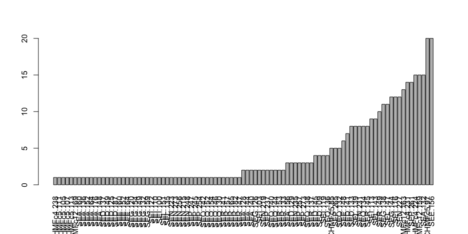

<!-- README.md is generated from README.Rmd. Please edit that file -->
repvar
======

[](https://www.tidyverse.org/lifecycle/#experimental) [](https://travis-ci.org/zkamvar/repvar) [](https://codecov.io/github/zkamvar/repvar?branch=master)

The goal of repvar is to find the minimum number of samples that will represent all variables in a data set. This was built for population genetic data, but is generalizable to any discrete data type that can be represented as an integer matrix.

Installation
------------

This package is not currently on CRAN, but you can install it like so:

``` r
# install.packages("remotes") # or devtools or ghit
remotes::install_github("zkamvar/repvar")
```

Example
-------

Here is a basic example of how you can identify the minimum set. We will use the pre-packaged `monilinia` data set from Everhart and Scherm 2016.

``` r
options(width = 120)

library("repvar")
data(monilinia)
dim(monilinia)
#> [1] 264  95
print.table(monilinia[1:10, 1:10], zero.print = ".")
#>      CHMFc4.224 CHMFc4.231 CHMFc4.238 CHMFc5.85 CHMFc5.97 CHMFc5.111 CHMFc5.105 CHMFc5.107 CHMFc5.113 CHMFc12.163
#> A004          1          .          .         1         .          .          .          .          .           1
#> A002          1          .          .         .         1          .          .          .          .           .
#> A011          1          .          .         .         1          .          .          .          .           .
#> A009          1          .          .         .         1          .          .          .          .           .
#> A006          1          .          .         .         1          .          .          .          .           .
#> A013          1          .          .         .         1          .          .          .          .           1
#> A008          1          .          .         .         .          1          .          .          .           1
#> A016          .          1          .         1         .          .          .          .          .           .
#> A012          .          1          .         1         .          .          .          .          .           1
#> A021          .          1          .         .         1          .          .          .          .           .

# Shuffle the data set 200 times to find an optimal number of samples
set.seed(2018)
id_list <- find_samples(monilinia, n = 200, cut = TRUE, progress = FALSE)
id_list
#> [[1]]
#>  [1] "A233" "A610" "A154" "A603" "A666" "A163" "A293" "A339" "A590" "A071" "A085" "A218" "A269" "A074" "A182" "A417"
#> [17] "A681" "A176" "A366" "A489" "A216" "A172" "A488" "A406" "A390" "A039" "A010" "A016" "A692" "A129"
#> 
#> [[2]]
#>  [1] "A233" "A610" "A154" "A603" "A666" "A163" "A293" "A339" "A590" "A071" "A085" "A218" "A269" "A074" "A182" "A417"
#> [17] "A681" "A176" "A367" "A489" "A191" "A172" "A488" "A408" "A390" "A404" "A387" "A016" "A692" "A571"
#> 
#> [[3]]
#>  [1] "A233" "A610" "A154" "A603" "A666" "A163" "A293" "A339" "A590" "A071" "A085" "A218" "A269" "A074" "A182" "A417"
#> [17] "A681" "A176" "A367" "A522" "A191" "A172" "A488" "A408" "A390" "A547" "A385" "A480" "A692" "A088"
lengths(id_list)
#> [1] 30 30 30
print.table(monilinia[id_list[[1]], 1:10], zero.print = ".")
#>      CHMFc4.224 CHMFc4.231 CHMFc4.238 CHMFc5.85 CHMFc5.97 CHMFc5.111 CHMFc5.105 CHMFc5.107 CHMFc5.113 CHMFc12.163
#> A233          .          1          .         .         .          .          .          1          .           1
#> A610          1          .          .         .         .          .          .          .          1           1
#> A154          .          1          .         .         1          .          .          .          .           1
#> A603          .          .          1         .         1          .          .          .          .           .
#> A666          .          1          .         .         1          .          .          .          .           .
#> A163          .          1          .         .         1          .          .          .          .           .
#> A293          1          .          .                                                                           .
#> A339          1          .          .         .         1          .          .          .          .           .
#> A590          .          1          .         .         1          .          .          .          .           1
#> A071          1          .          .         1         .          .          .          .          .           .
#> A085          1          .          .         .         1          .          .          .          .           1
#> A218          .          1          .         .         1          .          .          .          .           .
#> A269          .          1          .         .         1          .          .          .          .           1
#> A074          1          .          .         .         .          .          1          .          .           .
#> A182          .          1          .         .         1          .          .          .          .           .
#> A417          1          .          .         1         .          .          .          .          .           1
#> A681          .          1          .         .         1          .          .          .          .           1
#> A176          1          .          .         .         .          1          .          .          .           1
#> A366          1          .          .         .         1          .          .          .          .           .
#> A489          1          .          .         .         1          .          .          .          .           .
#> A216          .          1          .         .         1          .          .          .          .           .
#> A172          1          .          .         .         1          .          .          .          .           .
#> A488          .          1          .         .         1          .          .          .          .           1
#> A406          1          .          .         .         1          .          .          .          .           .
#> A390          1          .          .         1         .          .          .          .          .           1
#> A039          .          1          .         .         1          .          .          .          .           .
#> A010          .          .          1         .         1          .          .          .          .           .
#> A016          .          1          .         1         .          .          .          .          .           .
#> A692          1          .          .         .         1          .          .          .          .           1
#> A129          .          1          .         1         .          .          .          .          .           1
```

Real-world example
------------------

Because you get a list of ids, it's good to see which ones are actually useful. For this, you can calculate entropy. We will use the tidyverse to first create a table of samples and data, calculate entropy for each row, and then join them together. In general, we will want higher entropy values. For this, we will load three tidyverse packages:

``` r
library("tibble")
library("tidyr")
library("dplyr")
#> 
#> Attaching package: 'dplyr'
#> The following objects are masked from 'package:stats':
#> 
#>     filter, lag
#> The following objects are masked from 'package:base':
#> 
#>     intersect, setdiff, setequal, union
```

``` r
# Generate and filter the possible data sets ------------------------------
set.seed(2018 - 03 - 07)
res <- find_samples(monilinia, n = 10000, cut = TRUE, progress = FALSE) %>%
  tibble::enframe(name = "index", value = "ids") %>%            # create a data frame of of list columns
  dplyr::mutate(n = lengths(ids)) %>%                           # count the number of indices in each row
  dplyr::rowwise() %>%                                          # set the data frame to be computed by row
  dplyr::mutate(dat = list(monilinia[ids, ,drop = FALSE])) %>%  # add the original data set to each row
  dplyr::mutate(nall = sum(colSums(dat, na.rm = TRUE) > 0))     # count the number of columns

# calculate entropy for each data set -------------------------------------
# The statistics returns a data frame, but because we've embedded the data,
# we must calculate this separately and then merge it later.
entro <- res %>% 
  dplyr::mutate(e = list(entropy(dat))) %>% # calculate stats for each row
  dplyr::select(index, e) %>%               # retain only stats and index
  tidyr::unnest()                           # spread out the columns

# sort by E5, and missingness. ----------------------------
res_sort <- res %>%
  dplyr::inner_join(entro, by = "index") %>%
  dplyr::arrange(-E5, missing)
res_sort
#> # A tibble: 50 x 10
#>    index ids            n dat              nall    eH     G    E5 lambda missing
#>    <int> <list>     <int> <list>          <int> <dbl> <dbl> <dbl>  <dbl>   <dbl>
#>  1    46 <chr [30]>    30 <int [30 × 95]>    95  55.9  40.6 0.721  0.978 0.00877
#>  2    12 <chr [30]>    30 <int [30 × 95]>    95  55.7  40.4 0.721  0.978 0.00877
#>  3    28 <chr [30]>    30 <int [30 × 95]>    95  55.8  40.4 0.719  0.978 0.00877
#>  4    26 <chr [30]>    30 <int [30 × 95]>    95  55.5  40.2 0.719  0.978 0.00772
#>  5    17 <chr [30]>    30 <int [30 × 95]>    95  55.4  40.1 0.718  0.978 0.00772
#>  6    24 <chr [30]>    30 <int [30 × 95]>    95  55.4  40.1 0.718  0.978 0.00772
#>  7    41 <chr [30]>    30 <int [30 × 95]>    95  55.1  39.8 0.718  0.977 0.00772
#>  8    23 <chr [30]>    30 <int [30 × 95]>    95  55.1  39.8 0.717  0.977 0.00772
#>  9    48 <chr [30]>    30 <int [30 × 95]>    95  55.5  40.1 0.717  0.978 0.00596
#> 10    27 <chr [30]>    30 <int [30 × 95]>    95  55.3  39.9 0.717  0.977 0.00772
#> # ... with 40 more rows
```

From here, we can see the samples

``` r
cat(res_sort$ids[[1]], sep = ", ")
#> A233, A610, A154, A603, A666, A163, A293, A339, A590, A071, A085, A218, A269, A074, A182, A417, A681, A176, A367, A489, A191, A172, A488, A406, A390, A404, A385, A016, A692, A168
```

And visualize the distribution:

``` r
res_sort$dat[[1]] %>%
  colSums(na.rm = TRUE) %>%
  sort() %>%
  barplot(las = 3)
```



### Calculating entropy by groups

We can group our variables as well.

``` r
f <- gsub("[.][0-9]+", "", colnames(monilinia))
f <- factor(f, unique(f))
entromean <- res %>% 
  dplyr::mutate(e = list(entropy(dat, f = f))) %>% # calculate stats for each row
  dplyr::select(index, e) %>%               # retain only stats and index
  tidyr::unnest() %>%                       # spread out the columns
  dplyr::group_by(index) %>%
  dplyr::summarize_if(is.numeric, mean)     # calculate mean over all loci

# sort by E5, and missingness. ----------------------------
resmean_sort <- res %>%
  dplyr::inner_join(entromean, by = "index") %>%
  dplyr::arrange(-E5, missing)
resmean_sort
#> # A tibble: 50 x 10
#>    index ids            n dat              nall    eH     G    E5 lambda missing
#>    <int> <list>     <int> <list>          <int> <dbl> <dbl> <dbl>  <dbl>   <dbl>
#>  1    46 <chr [30]>    30 <int [30 × 95]>    95  4.67  3.60 0.716  0.702 0.0103 
#>  2    36 <chr [30]>    30 <int [30 × 95]>    95  4.64  3.62 0.716  0.698 0.00513
#>  3    26 <chr [30]>    30 <int [30 × 95]>    95  4.64  3.59 0.715  0.699 0.00769
#>  4    28 <chr [30]>    30 <int [30 × 95]>    95  4.67  3.62 0.715  0.700 0.0103 
#>  5    17 <chr [30]>    30 <int [30 × 95]>    95  4.62  3.60 0.714  0.698 0.00769
#>  6    27 <chr [30]>    30 <int [30 × 95]>    95  4.63  3.60 0.713  0.697 0.00769
#>  7    24 <chr [30]>    30 <int [30 × 95]>    95  4.63  3.59 0.713  0.698 0.00769
#>  8     3 <chr [30]>    30 <int [30 × 95]>    95  4.62  3.59 0.713  0.696 0.00769
#>  9    20 <chr [30]>    30 <int [30 × 95]>    95  4.62  3.60 0.713  0.696 0.00513
#> 10    22 <chr [30]>    30 <int [30 × 95]>    95  4.61  3.57 0.712  0.694 0.00769
#> # ... with 40 more rows
```
